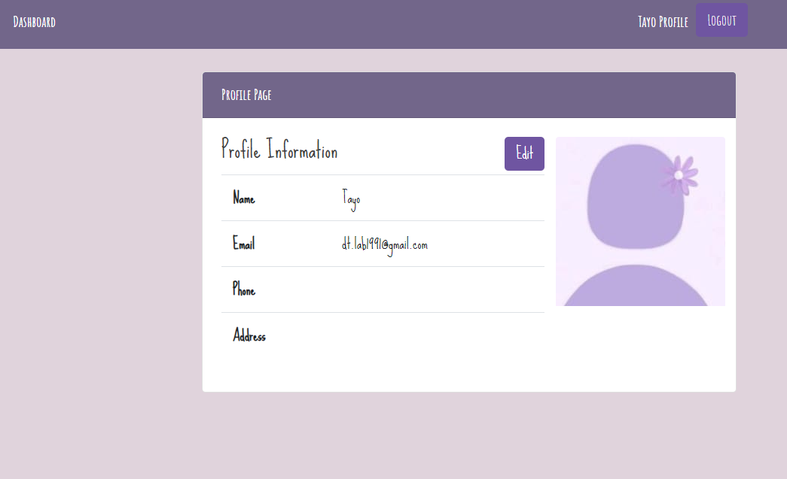
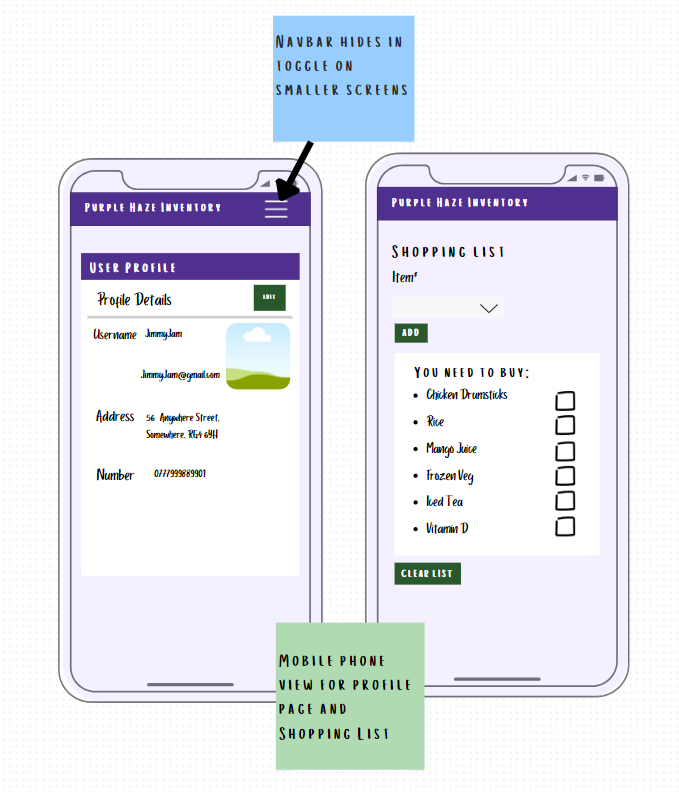
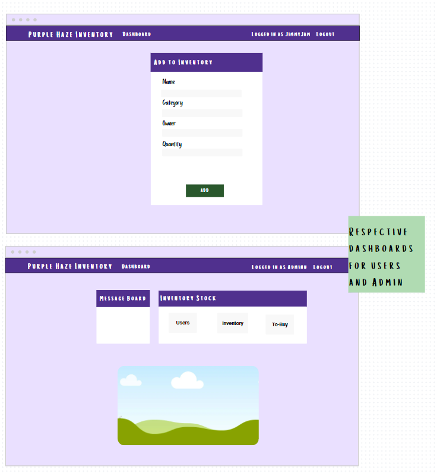
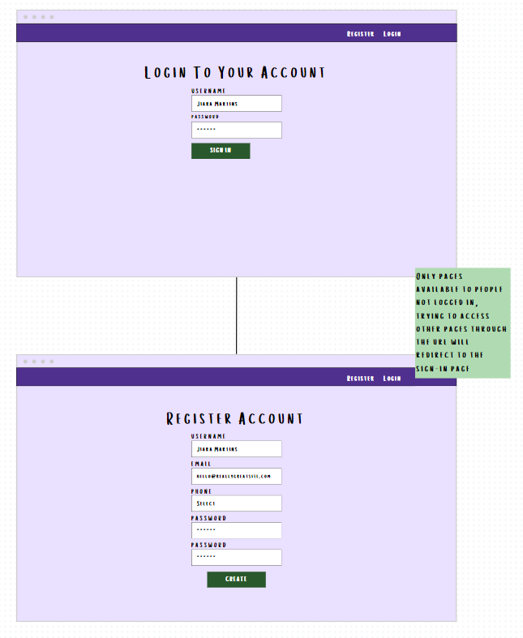
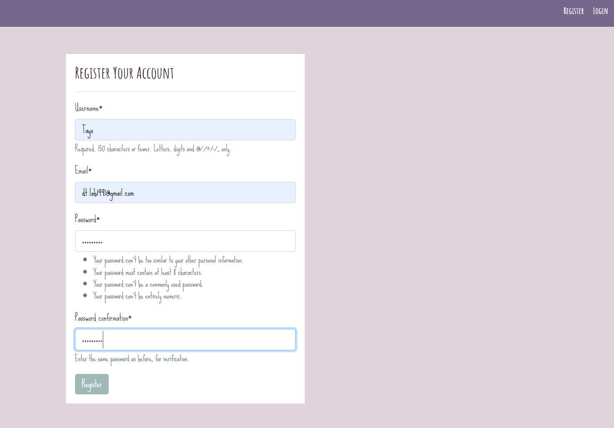
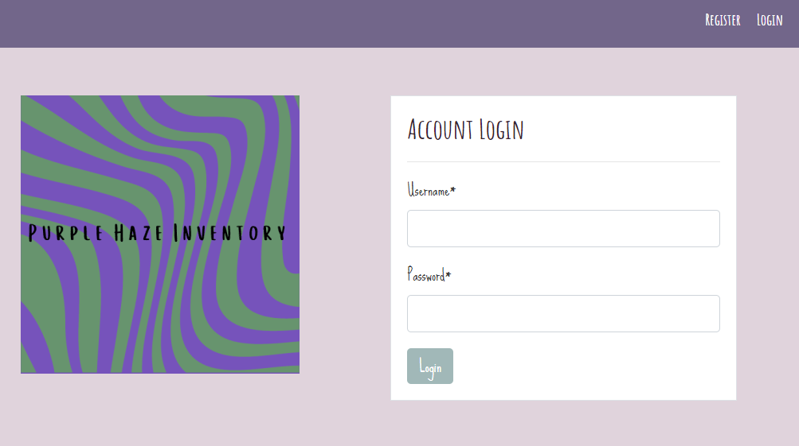
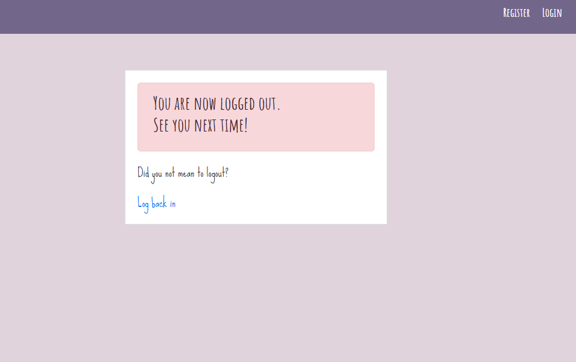
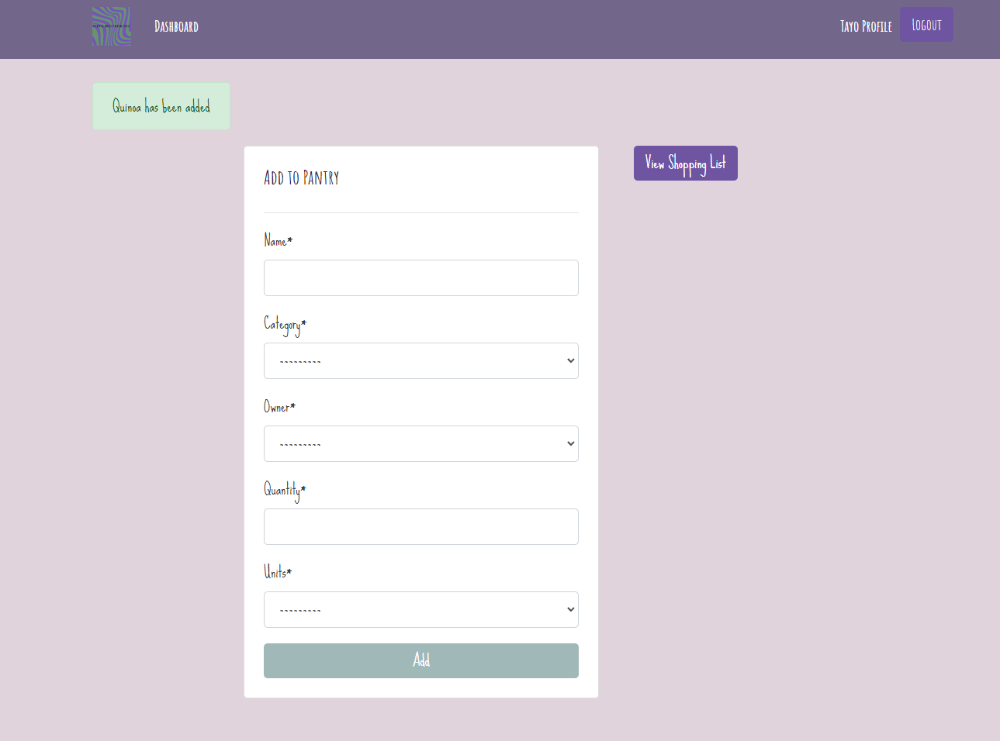
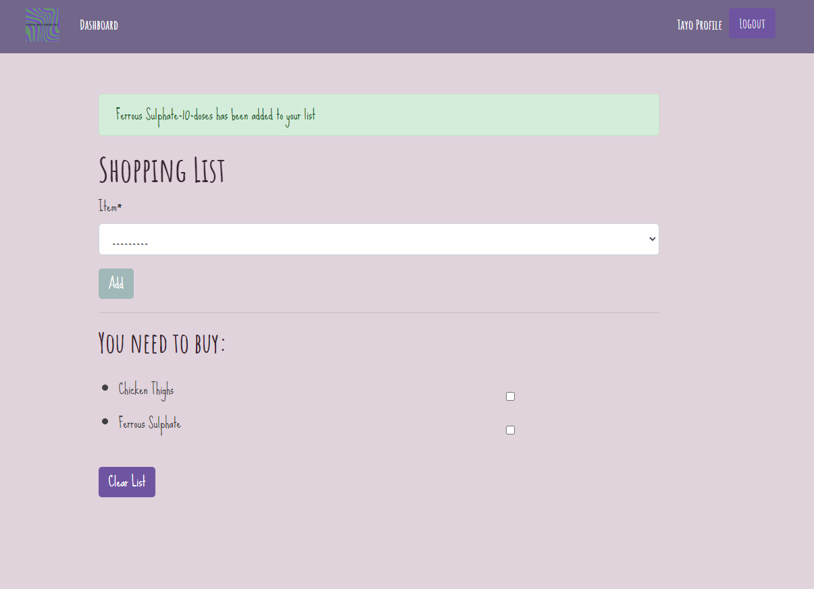

# individual-project: Inventory Management
Welcome to the **Inventory Management** project repository! My final project with Code Institute - built with Django

This project is designed to help manage an inventory of food and medications. It also includes features to add food items from the inventory to a shopping list. This project serves as a base for building additional features such as an NFC scanner, budgeting, recipe searches, and reminders.

 
<!-- Logo -->
<h3 align="center">Purple Haze Inventory README</h3>

  

<!-- Table of Contents -->
<h3 align="left">Table of Contents</h3>

  <ol>
    <li><a href="#project-overview">Project Overview</a></li>
    <li><a href="#features">Features</a></li>
    <li><a href="#usage">Usage</a></li>
    <li><a href="#installation">Installation</a></li>
    <li><a href="#roadmap">Roadmap</a></li>
    <li><a href="#contributing">Contributing</a></li>
    <li><a href="#license">License</a></li>  
    <li><a href="#contact">Contact</a></li>
    <li><a href="#acknowledgments">Acknowledgments</a></li>
  </ol>

(<a href="#readme-top">back to top</a>)

<!-- ABOUT THE PROJECT -->
## Project Overview

This project is aimed at managing food and medication inventory effectively. Users can add items to the inventory, create shopping lists from the inventory, and perform various other management tasks.

The users will have access to thier profile pages and shopping lists. 

## Features

- **User Management**: Create and manage user accounts.

- **Inventory Management**: Add, delete, and categorize items in the inventory.
- **Shopping List**: Add items from the inventory to a shopping list, view, and clear the shopping list.

### Pictures
Please see images of the plans and initial versions of the app pages

The anticipated mobile view of the user profile page and shopping list
 

The initial layout of the registration form
 

The initial user profile update form
 

The anticipated mobile view of the dashboards, the user and admin view are different
 

The initial dashboard layout

- **Future Enhancements**:
  - NFC Scanner integration.
  - Budgeting feature.
  - Recipe search functionality.
  - Reminders for inventory and shopping lists.

(<a href="#readme-top">back to top</a>)

### Pictures

- **Register**: Create a new user account.
- **Login**: Log in to your account.

- **Logout**: Log out of your account.

- **Inventory Management**: Add, delete, and view items in the inventory.

- **Shopping List**: Add items from the inventory to your shopping list and manage the list.

(<a href="#readme-top">back to top</a>)

## Contact

For any inquiries or feedback, please reach out to Diana via:

- Email: [dt.lab1991@gmail.com](mailto:dt.lab1991@gmail.com)
- GitHub: [Diana-is-Coding](https://github.com/Diana-is-Coding)

(<a href="#readme-top">back to top</a>)

<!-- ACKNOWLEDGMENTS -->
## Acknowledgments

Use this space to list resources you find helpful and would like to give credit to. I've included a few of my favorites to kick things off!

* [GitHub Pages](https://pages.github.com)
* [Font Awesome](https://fontawesome.com)
* [Canva] (https://canva.com)
* [KenBroTech] (https://youtube.com/@KenBroTech) (https://github.com/KenBroTech)

(<a href="#readme-top">back to top</a>)

<!-- MARKDOWN LINKS & IMAGES -->
<!-- https://www.markdownguide.org/basic-syntax/#reference-style-links -->

[Google-fonts]: https://fonts.google.com/
[Bootstrap.com]: https://img.shields.io/badge/Bootstrap-563D7C?style=for-the-badge&logo=bootstrap&logoColor=white
[Bootstrap-url]: https://getbootstrap.com

(<a href="#readme-top">back to top</a>)
